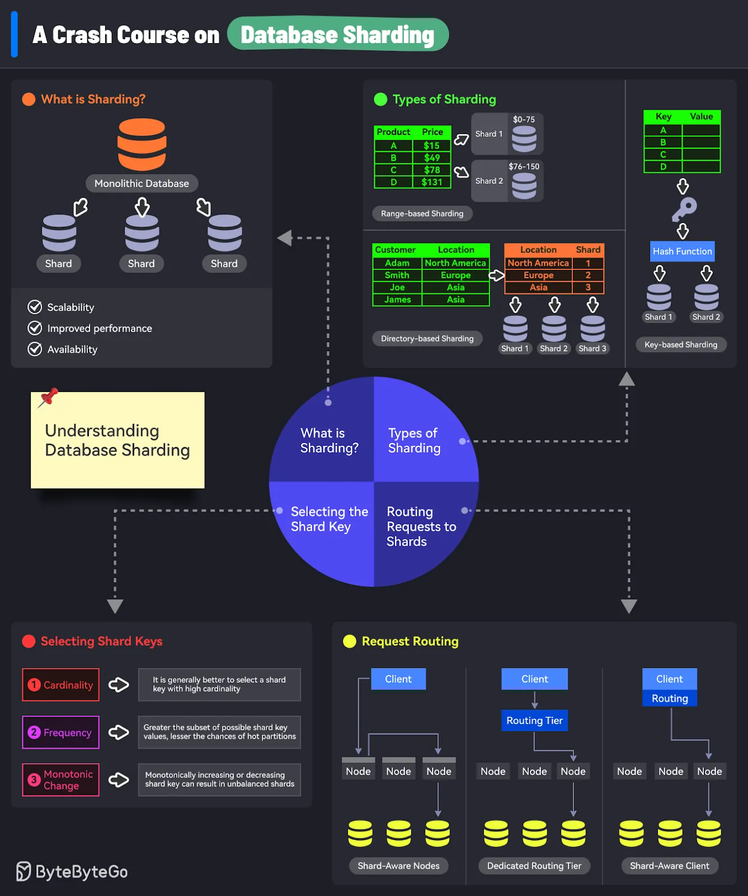

⚠️⚠️ Make sure you have solid mental models for understanding

### ✅ **Day 1: Foundation — Why Partition? Why Shard?**

--------------------------------------------------------------------------------------------------------------------------------------------------------

#### 📚 Concepts:

    * What is **Database Partitioning**?
    * What is Sharding V/s Partitioning?
    💡 Sharding is a subset of Partitioning   
    * Various Partitiong Techniques
    * Difference between **horizontal partitioning (sharding)** and **vertical partitioning**
    * What is Sharding V/s Clustering?
    * Evolution:
        * Monolith → Vertical scaling → Replication → Partitioning → Sharding
    * Problems solved by sharding:
        * Query performance
        * Write throughput
        * Data distribution
        * Storage limits
        * Trade-offs: **complexity vs scalability**

---------------------------------------------------------------------------------------------------------------------------------------------------------------------------

#### 📓 Terms to Learn (Terminology):

    * Partition Key
    * Shard Key
    * Logical vs Physical Partition
    * Hotspotting
    * Rebalancing
    * Global Secondary Index

---------------------------------------------------------------------------------------------------------------------------------------------------------------------------

### 🎥 Videos To Watch: 
    1. Arpit's Video on Partitioning V/s Sharding: https://youtu.be/wXvljefXyEo

---------------------------------------------------------------------------------------------------------------------------------------------------------------------------

#### 🧠 Exercise:

    * Draw the evolution chart: monolithic → replicated → partitioned → sharded
    * Problem: SQLite Partitioning (Single Server):
        1. Write a script that creates 3 separate SQLite DBs: users_a_f.db, users_g_m.db, users_n_z.db=
        2. Route inserts based on first letter of username.
        3. This simulates manual sharding logic.

    💡 Can be implemented using SQLLite Database. No setup required. Explore for more information

---------------------------------------------------------------------------------------------------------------------------------------------------------------------------

### 🤔 Thought Exercise
    Imagine you're building a database for a streaming service like Netflix. You store all video watch history. How would you partition or shard this dataset if:
        1. 50 million users
        2. Global access
        3. Write-heavy (many log entries per second)
        4. Must keep latency low

---------------------------------------------------------------------------------------------------------------------------------------------------------------------------

Final: Refer Database-sharding image

